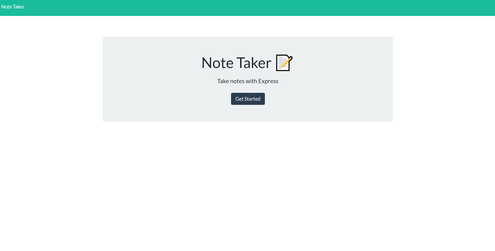
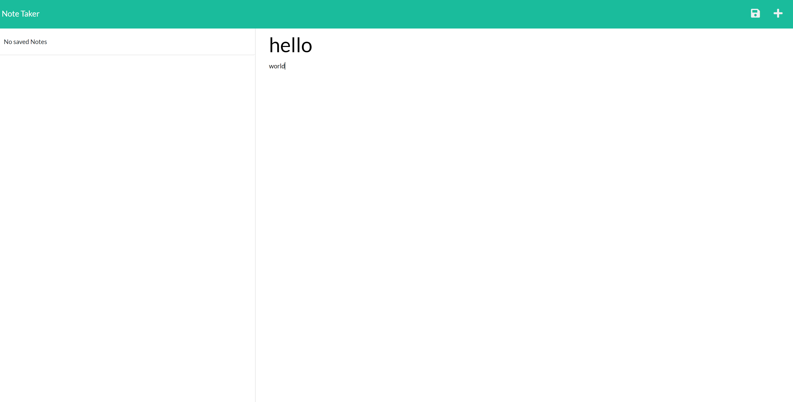
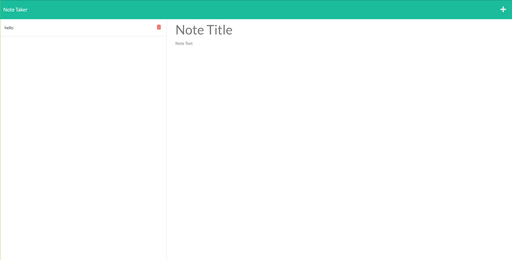

# Note Taker

## Description

test

## Table of Contents

* [Installation](#Installation)
* [Usage](#Usage)
* [License](#License)
* [Questions](#Questions)
* [Acknowledgements](#Acknowledgements)
* [Screenshots](#Screenshots)

## Installation

To install this project, open [https://note-taker-ma.herokuapp.com/](https://note-taker-ma.herokuapp.com/) in your browser.

## Usage

Once the page is loaded click "Get Started" and enter your note and its title!  when you're done click the 'save' icon and the saved note will display on the left side of the screen.  To delete simply click the 'delete' icon to the right of the saved note.

## License

MIT

## Questions

For additional information please contact me via GitHub at [https://github.com/malicea0783@gmail.com](https://github.com/malicea0783@gmail.com) or via email at [malicea0783@gmail.com](mailto:malicea0783@gmail.com?subject=[GitHub]%README%Generator).

## Acknowledgements

Valerie Michalecki 
GitHub: [https://github.com/vmichalecki](https://github.com/vmichalecki)

## SCreenshots

